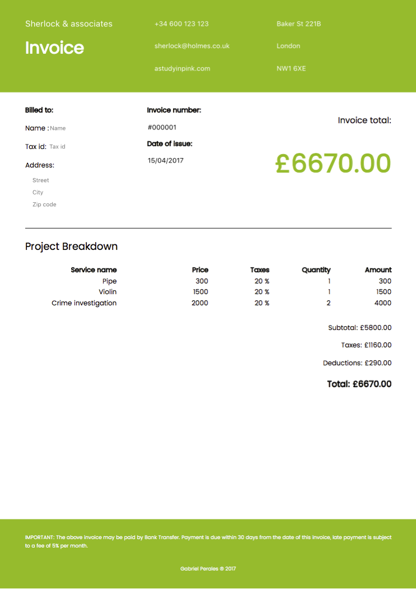

# Invoizr

App for creating invoices



## Why?

There are too many TODO Apps for learning new languages, so I wanted to do something
useful with the same bases that the TODO Apps have.

## How?

This is a SPA built with Elm, and there is not backend. I want to make it work offline
and I also want to use PouchDB to store invoices and contacts in a database.

## Getting Started

Just install node and elm dependencies with

```bash
$ npm install
$ elm-package install
```

and run it with `npm start`
